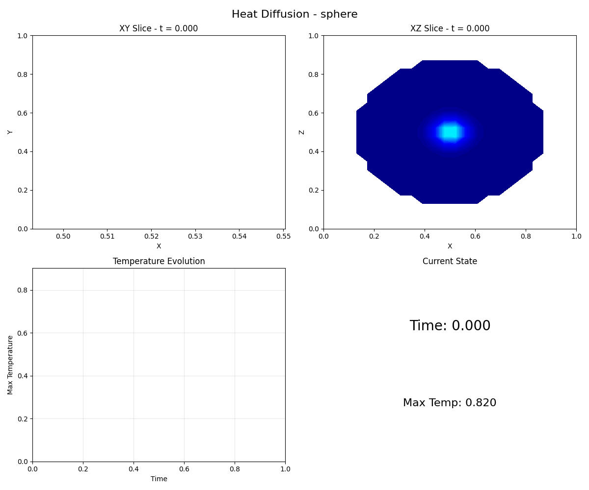
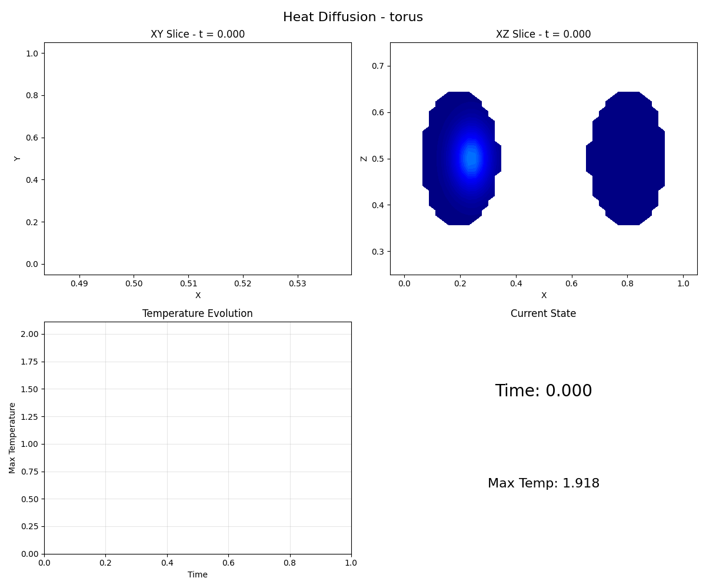
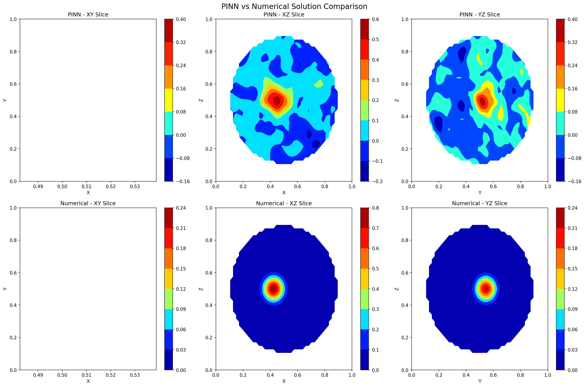
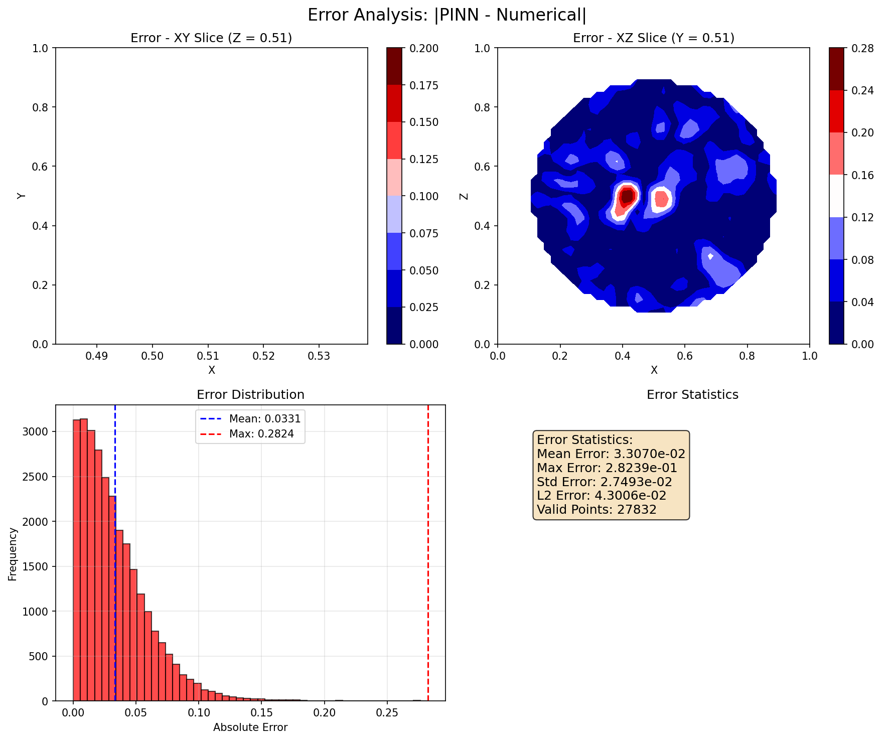
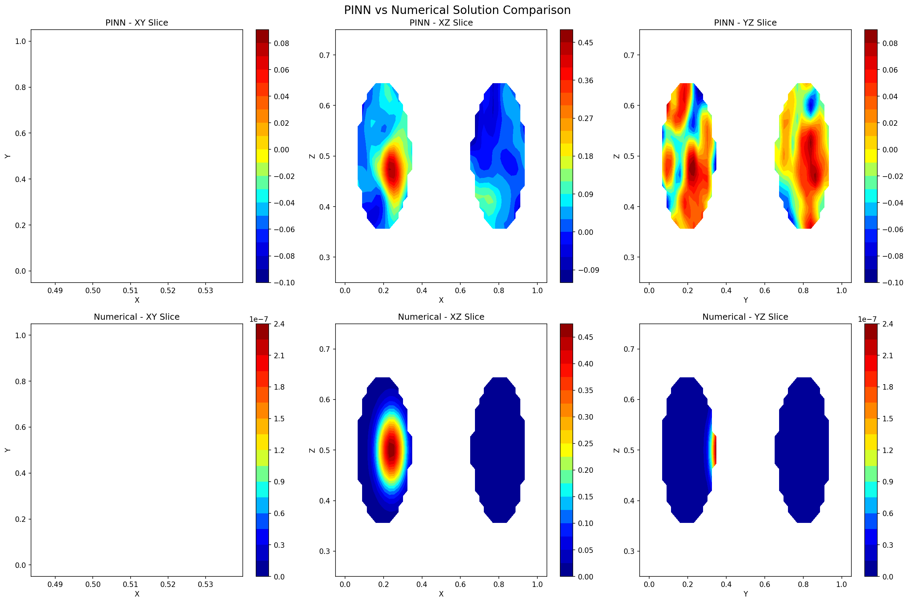
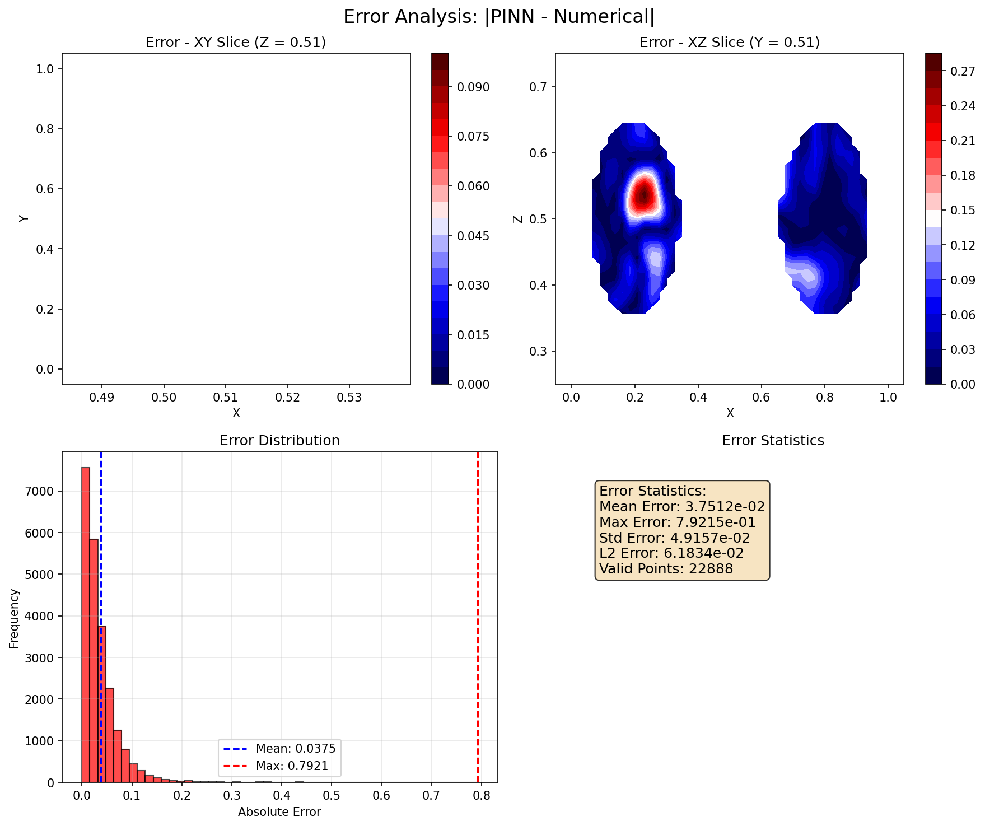
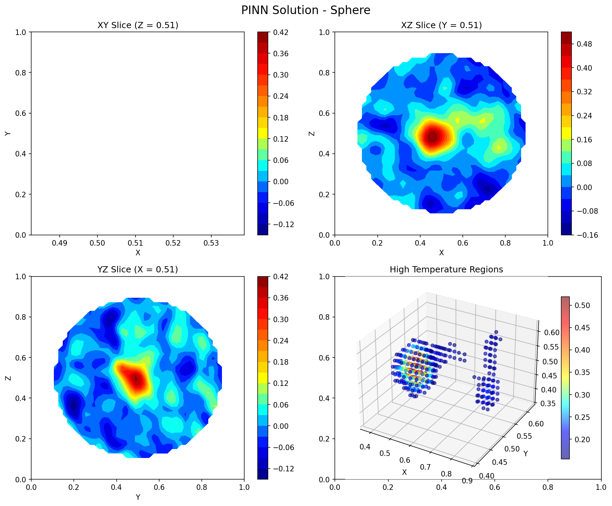
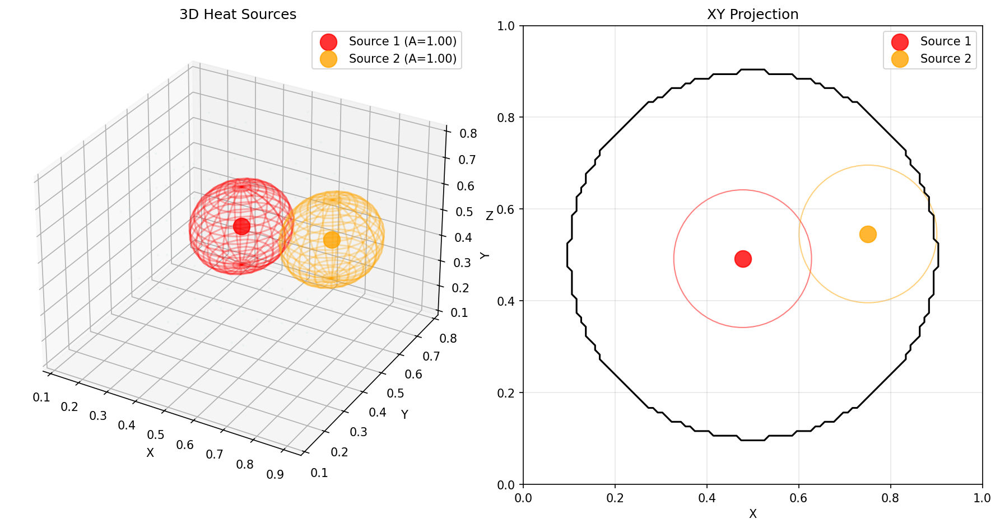

# Solving the 3D Heat Equation with Physics-Informed Neural Networks

## Abstract

This repository looks at solving the three dimensional transient heat equation. It uses Physics Informed Neural Networks as well as standard numerical solvers. The networks include the partial differential equation in the loss function. This makes the model follow the physics. Fourier feature embeddings are included to capture high frequency behaviour. There is also an option to use residual layers.

A finite difference solver was also implemented. Both explicit and implicit versions are provided. This gives a baseline to check the results of the neural network. The repository contains the PINN, the finite difference solver, and scripts for visualising results. The visualisations make it easier to see if the solution is sensible.

## Quick Start

The primary way to use this project is through the interactive GUI.

1.  **Clone the repository.**
2.  **Navigate to the `3d/` directory.**
3.  **Create and activate a Python virtual environment.**
4.  **Install the dependencies:** `pip install -r requirements.txt`
5.  **Run the interactive demo:** `python3 interactiveDemo.py`
6.  **Explore:** You can use the preset domains or upload your own .obj files (more details below), and see both comparisions between numerical and PINN outputs but also your heat solution in 3d with clear graphs and visualisations

## Table of Contents
- [1. Introduction](#1-introduction)
- [2. Mathematical Formulation](#2-mathematical-formulation)
- [3. Implementation Details](#3-implementation-details)
- [4. The Interactive Demo](#4-the-interactive-demo)
- [5. Gallery](#5-gallery)
- [6. Conclusion and Future Work](#6-conclusion-and-future-work)
- [7. Project Structure](#7-project-structure)
- [8. Advanced Usage: Command Line Options](#8-advanced-usage-command-line-options)
- [9. Troubleshooting](#9-troubleshooting)
- [10. License](#10-license)

## 1. Introduction

Partial differential equations appear in many areas of science and engineering. Solving them can be computationally demanding. Standard methods such as finite difference or finite element work well but get expensive in three dimensions or with irregular geometries. PINNs offer an alternative because they do not need large amounts of labelled data. They can also generalise well by directly enforcing the equations.

The focus of this project is the three dimensional heat equation. The main solver is the PINN. The finite difference solver is included as a reference. Visualisation tools are included to show the behaviour of the solvers. The aim is to provide a working PINN, compare it with a traditional method, and handle realistic boundary and initial conditions.

## 2. Mathematical Formulation

### 2.1. The 3D Heat Diffusion Equation

I am concerned with the solution of the transient 3D heat equation, which is a parabolic partial differential equation that describes the distribution of heat in a given region over time. The equation is given by:

```math
\frac{\partial u}{\partial t} = \alpha \nabla^2 u + S(\mathbf{x}, t), \quad \forall (\mathbf{x}, t) \in \Omega \times (0, T)
```

where $u(\mathbf{x}, t)$ is the temperature at spatial coordinate $\mathbf{x} = (x, y, z)$ and time $t$, $\alpha \in \mathbb{R}^+$ is the thermal diffusivity, $\nabla^2$ is the Laplacian operator, and $S(\mathbf{x}, t)$ is a source term. The solution is sought in a spatial domain $\Omega \subset \mathbb{R}^3$ over the time interval $t \in [0, T]$.

The problem is well-posed when supplemented with an initial condition and appropriate boundary conditions.

**Initial Condition:** The initial temperature distribution is given by:

```math
\nu(\mathbf{x}, 0) = u_0(\mathbf{x}), \quad \forall \mathbf{x} \in \Omega
```

**Boundary Conditions:** I impose Dirichlet boundary conditions on the boundary of the domain $\partial\Omega$:

```math
 u(\mathbf{x}, t) = g(\mathbf{x}, t), \quad \forall (\mathbf{x}, t) \in \partial\Omega \times [0, T] 
``` 

In the current implementation, I consider homogeneous Dirichlet boundary conditions, i.e., $g(\mathbf{x}, t) = 0$.

### 2.2. Physics-Informed Neural Network (PINN) Methodology

#### 2.2.1. Neural Network Ansatz

I approximate the solution $u(\mathbf{x}, t)$ with a deep neural network $u_\theta(\mathbf{x}, t)$, where $\theta$ denotes the set of trainable parameters (weights and biases) of the network. The network is a multilayer perceptron (MLP) that takes a 4-dimensional input $(\mathbf{x}, t)$ and outputs a scalar value representing the temperature.

The architecture of the network, implemented in the `DeltaPINN3D` class, incorporates several advanced features to improve its performance:

*   **Fourier Feature Embeddings:** To address the spectral bias of MLPs, which tend to learn low-frequency functions more easily than high-frequency functions, I employ Fourier Feature Embeddings. The input coordinates are first mapped to a higher-dimensional feature space using a sinusoidal mapping:

```math
\gamma(\mathbf{v}) = [\cos(2\pi \mathbf{B}\mathbf{v}), \sin(2\pi \mathbf{B}\mathbf{v})]
```

where $\mathbf{v} = [\mathbf{x}, t]$ and $\mathbf{B}$ is a matrix of fixed random frequencies drawn from a Gaussian distribution. This allows the network to learn high-frequency functions more effectively.

*   **Residual Blocks:** The network architecture can be configured to include residual connections, which have been shown to facilitate the training of very deep neural networks by improving gradient flow.

#### 2.2.2. Loss Function Formulation

The parameters $\theta$ of the neural network are optimised by minimising a composite loss function that enforces the physical constraints of the problem. The loss function is a weighted sum of the mean squared errors of the PDE residual, the boundary conditions, and the initial condition:

```math
\mathcal{L}(\theta) = w_{PDE} \mathcal{L}_{PDE}(\theta) + w_{BC} \mathcal{L}_{BC}(\theta) + w_{IC} \mathcal{L}_{IC}(\theta)
```

where $w_{PDE}, w_{BC}, w_{IC}$ are hyperparameters that can be used to balance the different loss terms.

**1. PDE Residual Loss ($\mathcal{L}_{PDE}$):**

The PDE residual is defined as:

```math
r_{PDE}(\mathbf{x}, t; \theta) = \frac{\partial u_\theta}{\partial t} - \alpha \nabla^2 u_\theta - S(\mathbf{x}, t)
```

The derivatives of the network's output with respect to its inputs are computed using automatic differentiation. The PDE loss is the mean squared error of the residual over a set of collocation points: ${\{(\mathbf{x}_i, t_i)\}}_{i=1}^{N_{PDE}}$ sampled from the spatio-temporal domain:

```math
\mathcal{L}_{PDE}(\theta) = \frac{1}{N_{PDE}} \sum_{i=1}^{N_{PDE}} |r_{PDE}(\mathbf{x}_i, t_i; \theta)|^2
```

**2. Boundary Condition Loss ($\mathcal{L}_{BC}$):**

The boundary condition loss is the mean squared error between the network's predictions and the prescribed boundary values over a set of points ${\{(\mathbf{x}_j, t_j)\}}_{j=1}^{N_{BC}}$ sampled on the boundary $\partial\Omega$:

```math
\mathcal{L}_{BC}(\theta) = \frac{1}{N_{BC}} \sum_{j=1}^{N_{BC}} |u_\theta(\mathbf{x}_j, t_j) - g(\mathbf{x}_j, t_j)|^2
```

**3. Initial Condition Loss ($\mathcal{L}_{IC}$):**

The initial condition loss is the mean squared error between the network's predictions and the initial temperature distribution over a set of points ${\{\mathbf{x}_k\}}_{k=1}^{N_{IC}}$ sampled within the domain $\Omega$ at $t=0$:

```math
\mathcal{L}_{IC}(\theta) = \frac{1}{N_{IC}} \sum_{k=1}^{N_{IC}} |u_\theta(\mathbf{x}_k, 0) - u_0(\mathbf{x}_k)|^2
```

#### 2.2.3. Optimisation

The optimisation problem consists of finding the optimal parameters $\theta^*$ that minimise the total loss function:

```math
\theta^* = \arg\min_\theta \mathcal{L}(\theta)
```

This is a non-convex optimisation problem that is typically solved using gradient-based optimisation algorithms. My implementation uses the following techniques:

*   **Optimiser:** The Adam optimiser is used for its adaptive learning rate capabilities and its good performance on a wide range of problems.

*   **Learning Rate Scheduling:** A cosine annealing learning rate schedule is employed to gradually decrease the learning rate during training, which can help to improve convergence.

*   **Gradient Clipping:** To prevent exploding gradients, which can be an issue in deep networks, I apply gradient clipping.

*   **Adaptive Loss Weighting:** The weights of the different loss terms can be adapted during training to improve convergence. My implementation includes a mechanism for adaptive loss weighting based on the magnitude of the individual loss terms.

### 2.3. Numerical Solution: The Finite Difference Method (FDM)

To validate the PINN solutions, I have implemented a numerical solver based on the Finite Difference Method (FDM). The FDM involves discretizing the spatial and temporal domains and approximating the derivatives in the PDE with finite differences.

#### 2.3.1. Discretisation

The spatial domain is discretised into a uniform Cartesian grid with spacing $(\Delta x, \Delta y, \Delta z)$, and the time domain is discretised into uniform time steps of size $\Delta t$. The temperature at a grid point $(i, j, k)$ at time step $n$ is denoted by $u^n_{i,j,k}$.

#### 2.3.2. Finite Difference Schemes

The second-order spatial derivatives are approximated using a central difference scheme:

```math
\frac{\partial^2 u}{\partial x^2}\bigg|_{(i,j,k)} \approx \frac{u_{i+1,j,k} - 2u_{i,j,k} + u_{i-1,j,k}}{(\Delta x)^2}
```

Similar expressions are used for the $y$ and $z$ derivatives. The time derivative is approximated using either a forward difference for the explicit scheme or a backward difference for the implicit scheme.

*   **Explicit Scheme (Forward Euler):** The temperature at the next time step is calculated explicitly from the values at the current time step. This scheme is computationally efficient but is only conditionally stable. The time step must satisfy the Courant Friedrichs Lewy (CFL) condition:

```math
\Delta t \le \frac{1}{2\alpha} \left( \frac{1}{(\Delta x)^2} + \frac{1}{(\Delta y)^2} + \frac{1}{(\Delta z)^2} \right)^{-1}
```

*   **Implicit Scheme (Crank Nicolson):** This scheme is unconditionally stable and allows for larger time steps. It involves solving a sparse linear system at each time step. The Crank Nicolson scheme is a second-order accurate method in time and and is generally preferred for its stability and accuracy.

## 3. Implementation Details

### 3.1. Domain Representation

Complex domains are represented using Signed Distance Functions (SDFs). An SDF is a function that, for any point in space, returns the shortest distance to the boundary of the domain. The sign of the SDF indicates whether the point is inside or outside the domain. This representation allows us to easily define complex geometries and to sample points both inside and on the boundary of the domain.

### 3.2. Collocation Point Sampling

The collocation points used to enforce the PDE, boundary conditions, and initial condition are sampled as follows:

*   **PDE Points:** Sampled randomly from the interior of the domain. I use Latin Hypercube Sampling to ensure a more uniform coverage of the domain.

*   **Boundary Points:** Sampled on the boundary of the domain. For domains defined by SDFs, these points are found by finding the zero-level set of the SDF.

*   **Initial Condition Points:** Sampled randomly from the interior of the domain at time $t=0$.

### 3.3. Visualisation Techniques

A suite of advanced visualisation tools is provided to analyse the results. These include:

*   **3D Isosurfaces:** Generated using the marching cubes algorithm to visualise surfaces of constant temperature.

*   **Volumetric Rendering:** Provides a way to visualise the temperature distribution throughout the entire 3D domain.

*   **Animations:** Time evolution of the temperature distribution is visualised by creating animated GIFs.

### 3.4. Custom Domain Geometries from `.obj` Models

Beyond the predefined shapes, this framework supports the use of custom 3D geometries by importing Wavefront `.obj` files. This allows for the simulation of heat diffusion in complex and irregular domains. The conversion from a polygonal mesh to a volumetric domain representation suitable for the PINN is handled by generating a Signed Distance Function (SDF) on a voxel grid.

#### 3.4.1. Mesh Requirements for SDF Conversion

The accuracy and validity of the generated SDF are critically dependent on the topological properties of the input mesh. For a successful conversion, the `.obj` model **must be a watertight manifold**.

*   **Watertight Geometry:** A watertight, or "manifold," mesh is one that represents a fully enclosed volume with no holes. Every edge must be shared by exactly two faces. This property is essential because the SDF algorithm needs to unambiguously distinguish the interior from the exterior of the domain. Non-watertight meshes, which may contain holes, disconnected components, or non-manifold edges, can lead to an ambiguous or incorrect SDF, where the sign of the distance is flipped, effectively turning the object "inside-out." The code will attempt to automatically fill holes in non-watertight meshes, but this process may not always succeed. For best results, it is recommended to use a watertight mesh.

*   **Consistent Face Normals:** The orientation of the faces (normals) in the mesh should be consistent, with all normals pointing outwards from the volume. The sign of the SDF at a given point is determined by the dot product of the vector from the closest point on the mesh to the query point and the normal of that closest face. Inconsistent normals will result in an incorrect sign for the SDF.

*   **Euler Number:** A useful diagnostic for mesh quality is the Euler number, $\chi = V - E + F$, where $V$, $E$, and $F$ are the number of vertices, edges, and faces, respectively. For a single, closed, watertight mesh without any handles (i.e., topologically equivalent to a sphere), the Euler number should be 2. Deviations from this value can indicate holes, handles, or other topological complexities that may affect the SDF generation.

#### 3.4.2. Conversion Process

The conversion from a polygonal mesh to a volumetric SDF is a computationally intensive process that involves determining the shortest distance from every point in a 3D grid to the surface of the mesh. Mathematically, the Signed Distance Function, $SDF(\vec{x})$, for a given point $\vec{x} \in \mathbb{R}^3$ and a mesh surface $\mathcal{S}$, is defined as:

$ SDF(\vec{x}) = \text{sign}(\vec{n}_{\vec{p}} \cdot (\vec{x} - \vec{p})) \cdot \inf_{\vec{p} \in \mathcal{S}} ||\vec{x} - \vec{p}||_2 $

where $\vec{p}$ is the point on the surface $\mathcal{S}$ closest to $\vec{x}$, and $\vec{n}_{\vec{p}}$ is the surface normal at that point. The sign of the function, which determines whether a point is inside or outside the volume, is given by the dot product of the vector from the closest surface point to the query point and the surface normal.

To make this calculation tractable for a high-resolution grid, a naive search over all mesh triangles is avoided. Instead, the `trimesh` library constructs a Bounding Volume Hierarchy (BVH), a spatial acceleration data structure that allows for the rapid culling of large portions of the mesh from the nearest-point search. This enables an efficient traversal of the mesh's topology to find the closest surface point for each grid point.


#### 3.4.3. Practical Recommendations

For best results, it is highly recommended to prepare custom `.obj` models in a 3D modeling software such as Blender before importing them. This includes:

*   **Ensuring Watertightness:** Use tools to fill holes, merge vertices by distance, and remove non-manifold geometry.

*   **Recalculating Normals:** Ensure all normals are pointing outwards.

*   **Simplifying Geometry:** For very complex models, simplifying the mesh can significantly reduce the memory and time required for SDF generation without sacrificing too much accuracy for the simulation.

**Note:** The numerical solver currently only supports the standard, built-in domain shapes (e.g., sphere, cube). Custom domains loaded from `.obj` files are only compatible with the PINN solver.

By adhering to these requirements, you can accurately simulate heat diffusion in a wide variety of complex, custom-defined domains.

## 4. The Interactive Demo

Once launched, the interactive demo provides a comprehensive GUI for running simulations and visualizing results. The layout consists of a control panel on the left and a visualization panel on the right.

**Key Controls:**

*   **Domain Configuration:**
    *   **Domain Shape:** Select from a list of predefined shapes (e.g., `sphere`, `cube`).
    *   **Load .obj File:** Load a custom geometry from a `.obj` or `.npy` file.
    *   **Voxelisation Resolution:** Adjust the resolution for `.obj` file conversion.

*   **Heat Sources:**
    *   **Add Sources:** Double-click on the 2D visualization plot to add a heat source at that location.
    *   **Manual Entry:** Manually specify the position and amplitude of a heat source.
    *   **Add/Remove/Clear:** Manage the list of current heat sources.

*   **Simulation Parameters:**
    *   **Thermal Diffusivity (\alpha):** Adjust the `alpha` parameter for the heat equation.
    *   **Max Time:** Set the total simulation time `t_max`.
    *   **Surface Smoothing:** Adjust the smoothing for the surface plot interpolation.

*   **Time Control:**
    *   **Time Slider:** Interactively scrub through time to see the solution evolve in the main visualization window.

*   **Simulation Control:**
    *   **Train PINN:** Train the Physics-Informed Neural Network on the current configuration. Two quality settings are available: a quick training for fast previews and a full quality training for more accurate results.
    *   **Solve Numerical:** Run the finite difference solver to generate a reference solution.
    *   **Compare Solutions:** Generate a side-by-side plot comparing the PINN and numerical results.
    *   **Animate:** Create a GIF of the simulation over time.
    *   **Show 3D Plot / Show Surface 3D Plot:** Open interactive 3D visualizations in your web browser. These plots allow you to see the heat diffusion over time using a time slider.

*   **Model Management & Visualisation:**
    *   **Load/Save Model:** Load a pre-trained PINN model or save the currently trained one.
    *   **Generate All Visualisations:** A one-click button to generate and save all possible static and interactive plots to the `demo_output` directory.

*   **Export:**
    *   **Save/Load Configuration:** Save or load the current simulation setup (domain, heat sources, parameters).
    *   **Export Visualisation:** Save the current view as a PNG or PDF file.

From the interactive demo, you can configure the domain, add heat sources, train the PINN model, solve for the numerical reference solution, and generate all visualizations.

## 5. Gallery

Here are some sample visualizations generated by the project:

**Heat Diffusion Animation (Sphere)**


**Heat Diffusion Animation (Torus)**


**PINN vs. Numerical Solver Comparison (Sphere)**


**Error between PINN and Numerical Solver (Sphere)**


**PINN vs. Numerical Solver Comparison (Torus)**


**Error between PINN and Numerical Solver (Torus)**


**PINN Solution Slices (Sphere)**


**Heat Source Configuration (Sphere)**


**Additional Visualizations**


## 6. Conclusion and Future Work

This project provides a comprehensive framework for solving the 3D transient heat equation using Physics-Informed Neural Networks. The results demonstrate that PINNs are a viable alternative to traditional numerical methods for solving PDEs, especially for problems with complex geometries. Future work could include extending the framework to other types of PDEs, implementing more advanced PINN architectures, and exploring the use of PINNs for inverse problems.

## 7. Project Structure

*   `deltaPinn3d.py`: Contains the core implementation of the Physics-Informed Neural Network (PINN) model. This includes the neural network architecture, the loss function definition, and the training loop.
*   `numericalSolution.py`: Implements the finite difference method (FDM) solver, which is used to generate a reference solution for comparison with the PINN. It supports both explicit and implicit time-stepping schemes.
*   `visualisation.py`: A suite of tools for visualizing the results of the simulations. It includes functions for plotting 3D isosurfaces, volumetric rendering, creating animations, and comparing the PINN and numerical solutions.
*   `interactiveDemo.py`: The main entry point for the interactive GUI application. It uses Tkinter to create the user interface and manages the simulation workflow.
*   `domainShapes.py`: Defines the geometry of the simulation domains using Signed Distance Functions (SDFs). It includes classes for standard shapes like spheres and cubes, as well as custom domains from `.obj` files.
*   `convertObj.py`: A utility script to convert `.obj` files into a format that can be used by the `domainShapes.py` module.
*   `requirements.txt`: A list of the Python dependencies required to run the project.

## 8. Advanced Usage: Command Line Options

While the interactive demo is the recommended workflow, the individual scripts can be run from the command line for advanced usage or scripting.

### 8.1. `deltaPinn3d.py`

```bash
python3 3d/deltaPinn3d.py \
    --hiddenSize 128 \
    --numLayers 6 \
    --epochs 5000 \
    --lr 1e-3 \
    --domain sphere \
    --numSources 2
```

### 8.2. `numericalSolution.py`

```bash
python3 3d/numericalSolution.py \
    --domain sphere \
    --nx 32 \
    --t_final 1.0
```

### 8.3. `visualisation.py`

```bash
python3 3d/visualisation.py \
    --model_path /path/to/your/model.pt \
    --numerical_path /path/to/your/numerical_solution.pkl \
    --tEval 0.5
```

## 9. Troubleshooting

**3D plots not showing up?**
- The interactive 3D plots (volumetric rendering, isosurfaces, surface heatmaps) require the `plotly` library. If it is not installed, the demo will fall back to 2D slices using Matplotlib. To enable the interactive 3D plots, install Plotly: `pip install plotly`

**Model not converging?**
- Reduce the learning rate.
- Increase the number of training epochs.- Adjust the weights of the loss terms.

**Out of memory?**
- Reduce the grid resolution (`--nx`).
- Use a smaller network architecture.

**Slow training?**
- Use a smaller grid or fewer epochs for quick tests.- If you have a supported GPU, you can modify the scripts to use it.

## 10. License

This project is licensed under the MIT License.